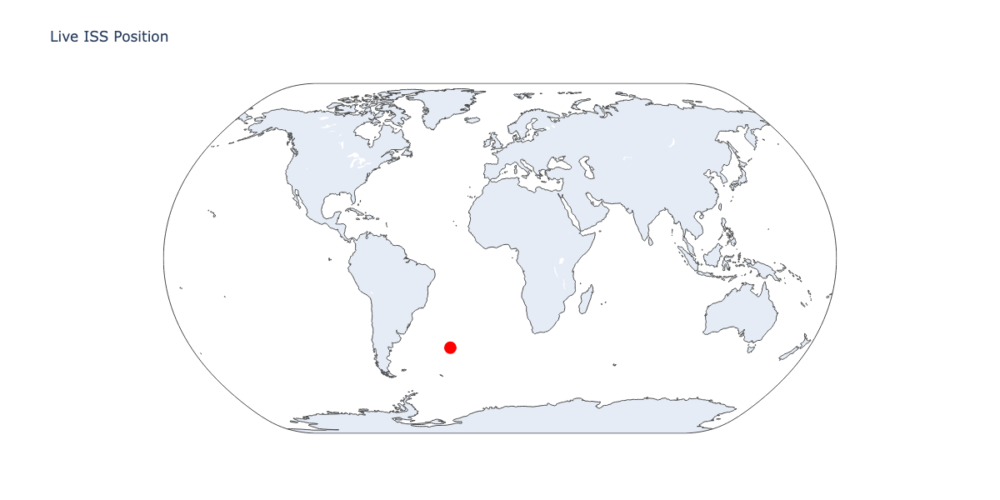
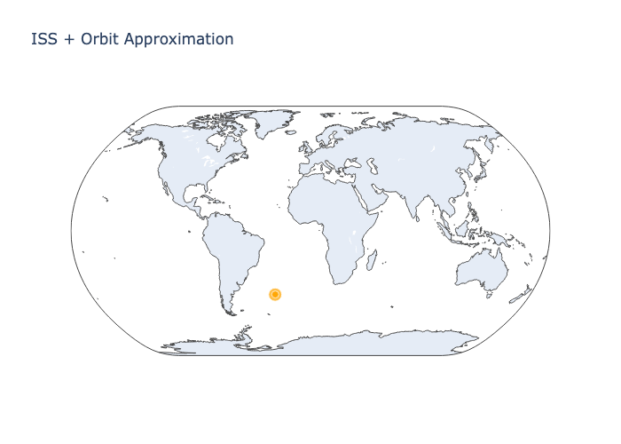

# Live ISS Tracker

**NASA Space API Visualization**: Real-time International Space Station location + crew.

## 🛰 Current Status

### Live ISS Position


**Red dot** = ISS current coordinates (updates every request).

### ISS Orbit Approximation


**Orange trail** = ISS position + nearby orbital path points.

### Current Crew
👨‍🚀 9 astronauts on ISS:
• Oleg Kononenko
• Nikolai Chub
• Tracy Caldwell Dyson
• Matthew Dominick
• Michael Barratt
• Jeanette Epps
• Alexander Grebenkin
• Butch Wilmore
• Sunita Williams


## 📡 Data Sources

**Open Notify API** (free, no key needed):
- [ISS Now](http://api.open-notify.org/iss-now.json) – live coordinates
- [Astronauts](http://api.open-notify.org/astros.json) – current crew

## 🛠️ Methods

**Python + Jupyter** (`notebooks/iss_tracker.ipynb`):

1. **API calls**: `requests` to fetch live ISS lat/lon + crew
2. **Visualization**: Plotly Geo scatter maps (interactive)
3. **Export**: High-res PNGs saved to `figures/`

## 🔄 How to Run

```bash
git clone https://github.com/Tinashe-stack/iss-tracker.git
cd iss-tracker
pip install -r requirements.txt
jupyter notebook notebooks/iss_tracker.ipynb
